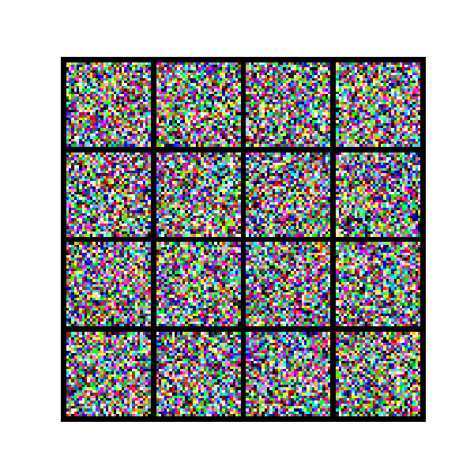

# vit-diffusion-cifar10

This repository showcases an applied ML project improving CIFAR-10 image classification. It starts with a baseline CNN, explores Vision Transformers, and integrates diffusion-generated synthetic data to boost robustness and generalization, comparing traditional and modern approaches in data-limited scenarios.

# ViT + Diffusion CIFAR-10 Research

This project explores improving image classification using Vision Transformers and synthetic data from diffusion models.

## Phase 1

- Baseline CNN on CIFAR-10

## Run

```bash
python train/train_cnn.py
```

# Vision Transformers vs CNNs vs Diffusion Models on CIFAR-10

## Overview

This project explores and compares three deep learning architectures:

- Convolutional Neural Networks (CNN)
- Vision Transformers (ViT)
- Diffusion Models

The goal is to evaluate performance on CIFAR-10 and understand trade-offs.

---

## Results

| Model | Accuracy |
| ----- | -------- |
| CNN   | 71.73%   |
| ViT   | 69.24%   |

---

## Key Insights

- CNN performs better on small datasets
- ViT requires more data but is competitive
- Diffusion models generate realistic images but are slower

---

## Generated Samples



---

## Setup

```bash
pip install -r requirements.txt
```
